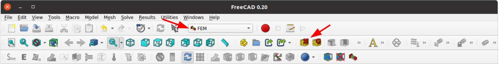
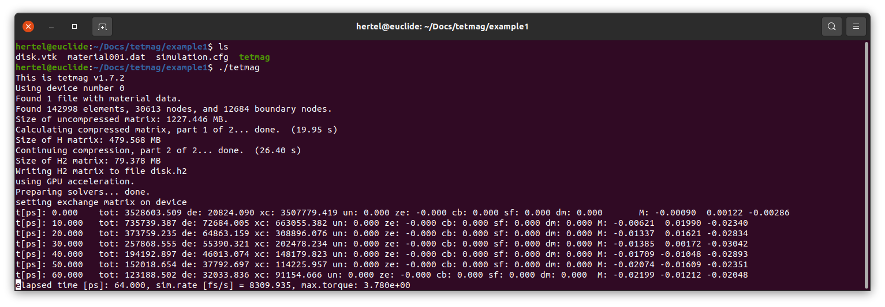

.. _example1:
Ex. 1: Magnetic vortex in a nanodisk
====================================

In this example, we will simulate the zero-field magnetic configuration in a Permalloy disk, which will result in a vortex state. First, we define the sample geometry and the
finite-element mesh. In this example we will do this with `FreeCAD <https://www.freecad.org/>`_. Other options, such as `gmsh <http://gmsh.info/>`_ can also be used.

Defining the geometry
---------------------

In FreeCAD, open a new project and select the "Part" workbench. From there, a cylinder shape can be selected as one of the default geometries:

.. image:: ./../figs/example1/freecad_cyl1.png
	   :width: 800

The radius and height of the cylinder geometry can be easily adapted in FreeCAD's Properties panel. We will use a radius of 150 units and a thickness of 30 units (the fact that FreeCAD considers these length units to be measured in  mm is irrelevant for the moment).

.. image:: ./../figs/example1/freecad_cyl2.png
	   :width: 800

Generating the finite-element mesh
----------------------------------

FreeCAD provides plugins to `gmsh  <http://gmsh.info/>`_ and `netgen <https://ngsolve.org/>`_, two efficient finite-element mesh generators. The mesh generators become accessible by changing to the "FEM" workbench:

The icons with the letter "N" and "G" refer to netgen and gmsh, respectively. In this example, we will use netgen. In the panel on the left, we select first-order elements by unchecking the "Second order" box, and set the maximum element size to 4,00:

The resulting mesh contains about 140,000 tetrahedral elements. Returning to the main panel, the finite-element mesh can be exported by selecting the object and navigating to "File -> Export..." In the pulldown menu, select the file type "FEM mesh formats" and name the output file `disk.vtk`

We now have the first input file of our simulation, ``disk.vtk``, which stores the FEM model and the sample geometry.

Defining the material properties
--------------------------------

The magnetic material of our nanodisk is Permalloy, whose micromagentic properties are characterized by a ferromagnetic exchange constant :math:`A = 1.3 \times 10^-11` J/m and a spontaneous magnetization :math:`M_s = 800` kA/m. The uniaxial anisotropy constant :math:`K_u` is negligibly small; we will set it to zero by simply omitting its value in the parameter definition file.

The information on the material properties is stored in an ASCII file named ``material001.dat``, which can be generated using your favorite file editor. In our example, the file should contain these two lines:

.. code-block:: RST
		
		A = 1.3e-11
		Ms = 8.0e5

		
		
Defining the simulation parameters
----------------------------------

The next step is to specify what we want to simulate. The information pertaining to the
simulation parameters is stored in an ASCII file with the name ``simulation.cfg``.

In our case, the file looks like this:

.. code-block:: RST
		
		name = disk
		scale = 1.e-9
		mesh type = vtk
		alpha = 1.0
		initial state = random
		time step = 2.0 # demag refresh interval in ps
		torque limit = 5.e-4
		duration = 5000  # simulation time in ps
		solver type = gpu

The meaning of the entries is as follows:

  - ``name``: The name of the simulated object. Must be identical to the stem of the filename containing the FEM mesh data. In our case, we stored the FEM mesh in the file `disk.vtk`, thus the name is `disk`.

  - ``scale``: The scaling factor relating the length units in the CAD model to the sample's physical size in [m]. Our disk was modeled with a radius of 150 and a thickness of 30 units. By using a value of ``scale`` equal to :code:`1.e-9`, we specify that our disk has a radius of 150 nm and thickness of 30 nm. With this scaling, the maximum cell we had chosen when generating the mesh is 4,00 nm, which is compatible with the material's exchange length.

  - ``mesh type``: Defines the format in which the finite-element mesh is stored. Possible options are ``VTK``, ``VTU``, and ``MSH``. The latter refers to files stored in GMSH format. The VTK and MSH readers  can read any version of these resepctive formats. 
    
  - ``alpha``: The Gilbert damping constant :math:`\alpha` in the Landau-Lifshitz-Gilbert equation. Although the value of :math:`\alpha` is a material-specific constant, it can be used as a control parameter in micromagnetic simulations. It is therefore defined in the `simulation.cfg` file. Here, for example, we use an unrealistically high damping value :math:`\alpha=1.0` in order to accelerate the calculation of the equilibrium state. We recommend using only values :math:`\alpha \ge 0.01`. Smaller values of :math:`\alpha` may lead to numerical instabilities.

  - ``initial state``: Micromagnetic simulations are numerical initial-value problems. An initial configuration must be defined, from which the magnetization structure begins to evolve. By default, the initial configuration is a homogeneous magnetic structure aligned along the :math:`z` direction. In our simulation, we start from a fully randomized initial state. A number of keywords of the ``initial state`` entry are available to define a few basic initial configurations. These options will be described in a separate section.

  - ``time step``: The name of this entry is a simplification, in the sense that the value does not describe the real size of individual time steps in the integration of the Landau-Lifshitz-Gilbert equation. The step size is chosen adaptively and is typically smaller than this value. Instead, the entry describes the time during which the magnetostatic field is "frozen" as the Landau-Lifshitz-Gilbert equation is integrated. While all other effective fields are continuously updated, the time-consuming calculation of the magnetostatic field is performed only on a subset of time steps. Here, we update the demagnetizing field only once every 2 ps in order to speed up the calculation. For a reliable calculation of the time evolution of the magnetization structure, the refresh time should be significantly smaller. A value of `0.1` ps  is usually sufficiently small, even for low-damping simulations.

    

  - ``torque limit``: This is a parameter defining a termination criterion of the simulation.  The Landau-Lifshitz-Gilbert equation yields a converged, stationary state when the torque exerted by the effective field :math:`\vec{H}_{\text eff}` on the magnetization
    :math:`\vec{M}` is zero everywhere in the magnetic material. Numerically, a value of exactly zero is never achieved, but a low value of :math:`\left\{\max\lVert\vec{M}_i\times\vec{H}_{{\text eff},i}\rVert\right\}`, where :math:`i` is a discretization point, indicates a nearly converged state. The entry ``torque limit`` defines the threshold value of the torque below which a discretized magnetization structure is considered converged. As a general tendency, the maximum value of the torque decreases as the simulation progresses, albeit not always monotonously. Due to numerical effects, the local torque may remain above a certain value even when the magnetic structure is converged and the system's energy remains constant. Therefore, the ``torque limit`` criterion will fail if a too small value is chosen. The choice of the threshold value may depend on the material parameters and on the entry of ``time step``. In practice, ``torque limit`` values between `1.e-4` and `1.e-3` have proven useful.

  - ``duration``: As described in the previous point, the termination criterion based on the local torque is not always reliable. In some cases, a simulation may continue indefinitely if it is not explicitly stopped. The value of ``duration`` imposes a hard limit on the simulation time, thereby acting as configuration-independent termination criterion. The simulation will end when the physical time in ps described by this value is reached. In our case, the simulation stops after 5 ns if, by then, the ``torque limit`` criterion has not yet been reached.

  - ``solver type``: Specifies whether GPU acceleration should be used. Possible entries are `CPU` and `GPU`. 

The keyword-type entries in the ``simulation.cfg`` file are case-insensitive. More options than those listed here are available. They will be discussed in other examples.

Running the simulation
----------------------

The simulation is started by launching `tetmag` on the command-line interface in the directory containing the above-mentioned input files:

Before the actual simulation begins, the code performs a number of calculations, provides a few notifications and prepares data needed for the simulation. In particular, it sets up a H2-type matrix, which is used to efficiently calculate the magnetostatic interaction. This matrix is stored in a file `<name>.h2`. When the simulation is re-run, possibly using different simulation parameters, this file is read from the disk, thereby saving the calculation time required to set up this matrix.

Once the preliminary calculations are finished, the simulation starts and outputs several data in the terminal. Each 10 ps of the simulation, the elapsed time in ps, the total energy, the partial energies, and the average reduced magnetization along the x, y, and z directions is printed as an output line in the terminal. In addition, the current value of the maximum torque (see the `torque limit` section in the previous paragraph) and the simulation rate is displayed as the ratio of simulated time in femtoseconds over real ("wall clock") time in seconds.

After some time, the simulation finishes and indicates the total simulation time. In our example, the simulation lasted somewhat less than six minutes:

During the simulation, ``tetmag`` has written several output files in the working directory:

Once the micromagnetic simulation is completed, the working directory contains the following additional files:

  - a series of magnetic configurations, stored as sequentially numbered VTU files,
  - a file ``<name>.log``, and
  - a file ``<name>.vtu``.

The VTU files can be analyzed with ParaView, as will be discussed in the next section. The LOG file contains detailed information on the evolution of several micromagnetic parameters during the calculation. The header of the log file explains which data is stored in each column:

.. code-block:: RST
		
		# Log file for simulation started Mon Jul 10 17:26:05 2023
		# on host euclide by user hertel
		# data in the columns is: 
		#(1) time in ps, (2) total energy , (3) demagnetizing energy, (4) exchange energy
		#(5) uniaxial anisotropy energy, (6) Zeeman energy, (7) cubic anisotropy energy (8) surface anisotropy energy, 
		#(9) bulk DMI energy (10) maximum torque, (11-13) Mx, My, Mz, (14-16) Hx, Hy, Hz. All energies in J/m3, all fields in T
		0.0000  3528603.5090    20824.0898      3507779.4191    0.0000  -0.0000 0.0000  0.0000  0.0000  2.847e+01       -0.0008989096018   0.001221334456  -0.002855368502      0.000000 0.000000 0.000000
		2.0000  2396019.1388    39078.4496      2356940.6891    0.0000  -0.0000 0.0000  0.0000  0.0000  1.649e+01       0.0001702643459  0.004836598221 -0.005454433698 0.000000 0.000000 0.000000
		4.0000  1645403.5929    55883.2351      1589520.3578    0.0000  -0.0000 0.0000  0.0000  0.0000  1.208e+01       0.0009439579436  0.009963304828  -0.01017827253 0.000000 0.000000 0.000000
		(...)

By default, the data is stored every two picoseconds. The output frequency in the logfile can, be controlled by adding a line to the ``simulation.cfg`` file specifying the ``log stride`` value. For example, to store the data in the log file once every picosecond, the ``simulation.cfg`` file should contain this line:

.. code-block:: RST
		
		 log stride = 1  # interval in ps between outputs in log file

		 
Similarly, one can modify the default output frequency in the console (every 10 ps) and regarding the output of the VTU configuration files (every 50 ps) with the keywords ``console stride`` and ``config stride``, respectively. To obtain VTU files each 60 ps and a line in the console every 20 ps, one would use:

.. code-block:: RST
		
		console stride = 20  # interval in ps between outputs in console 
		config stride = 60  # interval in ps between output of VTU configuration files

Note that anything following an octothorpe sign (`#`) is ignored in the input files ``simulation.cfg`` and ``material001.dat``. The comments after this symbol are optional explanations for the user.		

The end of the ``<name>.log`` file contains information on the termination of the simulation:

.. code-block:: RST
		
		(...)
		3118.0000	4883.1332	302.7239	4580.4093	0.0000	-0.0000	0.0000	0.0000	0.0000	2.023e-03	 0.001194291178  0.001545875097 -0.003595668125	0.000000 0.000000 0.000000
		3120.0000	4883.1330	302.7238	4580.4092	0.0000	-0.0000	0.0000	0.0000	0.0000	6.376e-04	 0.001195353567  0.001541824985 -0.003595669787	0.000000 0.000000 0.000000
		3122.0000	4883.1327	302.7236	4580.4091	0.0000	-0.0000	0.0000	0.0000	0.0000	4.926e-04	 0.001196407227  0.001537789069 -0.003595671424	0.000000 0.000000 0.000000
		# Convergence reached: maximum torque 0.000493 is below user-defined threshold.
		# Simulation ended Mon Jul 10 17:31:56 2023

In this case, the simulation ended because the ``torque limit`` criterion was met.

Visualizing and analyzing the results
-------------------------------------

The file ``<name>.vtu`` contains the magnetic configuration of the converged state reached when the micromagnetic simulation finished. It can be opened and viewed with ParaView:

.. image:: ./../figs/example1/ParaView_disk_2.png

The main information is stored in the vector field "Magnetization", which is the normalized directional field :math:`\vec{M}/M_s`. To display this vector field with arrows ("glyphs", as they are called in ParaView), select the options "Orientation Array-> Magnetization" and "Scale Array -> No scale array", as shown in the figure.

Visualizing and analyzing the computed magnetization structures with ParaView is an essential part of the workflow when performing simulations with ``tetmag``. It is therefore important to learn how to use this visualization software. We refer to the `ParaView documentation <https://www.paraview.org/resources/>`_ for adetailed description of the usage of ParaView.

In addition to the final, converged state, ``tetmag`` outputs a series of files describing the time evolution of the magnetization during the calculation. This data containing transient, unconverged magnetic configurations is stored in the series of numbered VTU files mentioned before. These files can be opened in ParaView with "File -> Open..." by selecting the group ``disk..vtu``. The time data is stored in the variable ``timeInPs``. It can be displayed in ParaView by selecting "Filters -> Annotation -> Annotate Global Data".

By using the green arrows in the toolbar on the top in ParaView, it is possible to navigate through the series of VTU files and obtain an animation of the magnetization dynamics.

The time evolution of the micromagnetic energy terms and the average magnetization compontents is stored in the ``<name>.log`` file. By selecting the appropriate columns, the data can be plotted with any program that can generate two-dimensional plots. To name a few options, one could use, e.g., `gnuplot <http://www.gnuplot.info/>`_, `Grace <https://plasma-gate.weizmann.ac.il/Grace/>`_, `ggplot2 <https://ggplot2.tidyverse.org/index.html>`_ in the case of R, or `matplotlib <https://matplotlib.org/>`_ when using python.

In our example, the evolution of the total energy, the magnetostatic ("demag") energy, and the exchange energy in time looks like this:

Note that the energies are stored as volume-averaged energy densities, expressed in units of [:math:`J/m^3`].
The graph above has been generated with this `R <https://www.r-project.org/>`_ script:

.. code-block:: R
		
		library(ggplot2)
		logdata <- read.table("disk.log")
		p <- ggplot(logdata,aes(x=V1)) + geom_line(aes(y=V2, color="V2")) + geom_line(aes(y=V3, color="V3")) + geom_line(aes(y=V4, color="V4")) +
		        scale_color_manual(values = c("red", "darkgreen", "blue"), labels=c("total", "demag", "exchange")) +
		        scale_y_log10() + xlab("time [ps]") + ylab(expression(paste("energy density [", J/m^{3}, "]"))) + theme(legend.title = element_blank()) 
		print(p)

