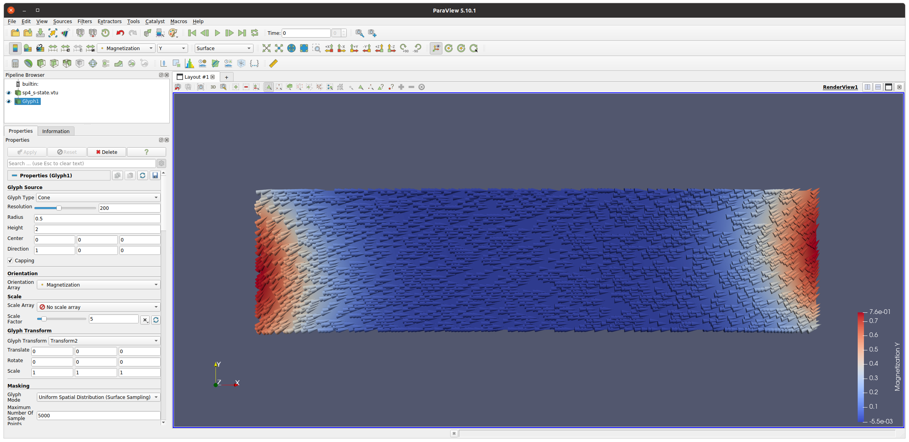

Ex. 2: :math:`\mu`\ MAG Standard Problem \#4
============================================

The  :math:`\mu`\ MAG project at `NIST <https://www.ctcms.nist.gov/~rdm/mumag.org.html>`_ has proposed a number of micromagnetic standard problems to compare and cross-validate simulation results obtained with different micromagnetic solvers. Here we will simulate the :math:`\mu`\ MAG `Standard Problem \#4 <https://www.ctcms.nist.gov/~rdm/std4/spec4.html>`_ with ``tetmag``. The simulation will involve several steps already discussed in Example \#1, such as the sample geometry definition and the FEM mesh generation, which we won't repeat here.

This standard problem addresses the magnetization dynamics in a sub-micron sized Permalloy thin-film element during a field-driven magnetic switching process. The sample geometry is a platelet of the size 500 nm :math:`\times` 125 nm :math:`\times` 3 nm. For the discretization, we will use a FEM cell size of :math:`3.0` nm. We start by defining the geometry with FreeCAD, as described in the previous example, and generate a tetrahedral finite-element mesh by using FreeCAD's netgen plugin.

Our mesh contains 48569 tetrahedral elements. We export the FEM mesh file in VTK format. As file name, we choose ``sp4_.vtk``. The underscore is used here to avoid a definition of the ``<name>`` ending with a number, which would interfere with the numbered output of VTU files generated during the simulation.

Calculating the initial configuration
-------------------------------------

The ``material001.dat`` file is identical to the one of previous example since, according to the problem specification, the material properties are again those of Permalloy:

.. code-block:: RST
		
		A = 1.3e-11
		Ms = 8.0e5

The problem specification requires a simulation in two steps. First, a specific zero-field equilibrium configuration, known as "s-state", is calculated by applying a saturating field along the [1,1,1] direction and gradually reducing it to zero. We will use an external field of :math:`\mu_0 H=1000` mT, which we wil reduce in steps of 200 mT to zero. The ``simulation.cfg`` file contains the following entries:

.. code-block:: RST

		name = sp4_
		scale = 1.e-9
		mesh type = vtk
		alpha = 1.0
		initial state = homogeneous_x 
		time step = 0.5 # demag refresh interval in ps
		torque limit = 5e-4
		duration = 5000  # simulation time in ps
		solver type = gpu
		
		hysteresis = yes
		  initial field = 1000 # first field value of hysteresis branch, in mT
		  final field = 0 # last field of hysteresis branch, in mT
		  field step = 200 # step width of increment / decrement in mT
		  hys theta = 45 # polar angles of magnetic hysteresis field [deg]
		  hys phi = 45 # azimuthal angles of magnetic hysteresis field [deg]

		remove precession = yes

The ``hysteresis`` keyword indicates that a sequence of equilibrium states will be calculated for different field values, according to the entries in the subsequent lines. The field direction is defined through two angles, ``theta`` and ``phi``, of a `spherical coordinate system <https://en.wikipedia.org/wiki/Spherical_coordinate_system>`_, where ``theta`` denotes the angle enclosed between the magnetization and the :math:`z` direction, and ``phi`` is the angle between the projection of the magnetization on the :math:`xy` plane and the :math:`x` axis. We use, again, a high damping constant ``alpha = 1.0`` to speed up the calculation and set the keyword ``remove precession = yes`` to  avoid unwanted precessional magnetization dynamics in this part of the calculation. We choose a somewhat smaller value for the ``time step`` than in the previous example to ensure a smooth calcualtion of the magnetization dynamics during the relaxation.

.. note ::
  It is strongly recommended to use the option ``remove precession = yes`` whenever the ``hysteresis =  yes`` option is set. Otherwise,  the ``torque limit`` termination criterion may not be attained during the quasistatic calculation of the magnetization structure.

At the end of this first part of the simulation, we obtain the zero-field "s-state" in the file ``sp4_.vtu`` in the working directory. The subdirectory ``Hysteresis_`` contains data on the converged states at the various field steps. We won't need this data in this project. We rename the VTU file with the s-state configuration to ``sp4_s-state.vtu``, delete all the VTU files with transient states, and the LOG file of the calculation:

.. code-block:: BASH

		mv sp4_.vtu sp4_s-state.vtu
		rm sp4_00*vtu sp4_.log 

We can verify with ParaView that the configuration is ``sp4_s-state.vtu`` contains the expected s-state:

Simulating the switching process
--------------------------------

According to the problem specification, a magnetic switching process is initiated by instantanously applying a static magnetic field of 25 mT to the platelet in the s-state configuration, with the field in the :math:`xy` plane oriented along a direction enclosing an angle of :math:`170^\circ` with the :math:`x` axis.
Furthermore, the damping constant :math:`\alpha` must be set to 0.02. 

To use a specific magnetic configuration stored in a VTU file, in our case the s-state from the file ``sp4_s-state.vtu``, as the starting configuration of a simulation, the name of the file must be provided in the ``initial state`` entry of the ``simulation.cfg`` file, prepended by the expression ``fromfile_``.

The ``simulation.cfg`` file used to simulate the field-driven switching contains the following entries:

.. code-block:: RST

		name = sp4_
		scale = 1.e-9
		mesh type = vtk
		alpha = 0.02
		initial state = fromfile_sp4_s-state.vtu
		time step = 0.1 # demag refresh interval in ps
		duration = 1000  # simulation time in ps
		solver type = gpu

		external field = 25.0 #  Hext in mT
		    theta_H = 90 # polar angle of the field direction in degree
		    phi_H = 170 # azimuthal angle

The ``torque limit`` entry ws removed to ensure that the simulation runs for 1 ns, irrespectice of the evolution of the magnetic structure. Moreover, we lowered the ``time step`` value to 0.1 ps, which is genarally a safe choice for low-damping simulations like this one. 
The ``material001.dat`` file remains unchanged compared to the one used for the quasistatic calculation of the s-state.

After the simulation, the resulting magnetization dynamics can be analyzed as described before. The image below displays the average :math:`y` component of the magnetization :math:`\langle M_y\rangle/M_s` as a function of time:

	  

The simulation with the 3 nm mesh yields a result that is already close to that `reported by other groups <https://www.ctcms.nist.gov/~rdm/std4/results.html>`_.Better agreement is obtained by lowering the mesh cell size to 1.5 nm. 
The specification of :math:`\mu`\ MAG Standard Problem \#4 requests a representation of a snapshot of the magnetic configuration in the platelet at the moment when the average :math:`x` component of the magnetization first crosses the zero line. The value of :math:`\langle m_x\rangle` is stored in column \#11 of the LOG file. The data shows that the first zero-crossing of :math:`\langle m_x\rangle` occurs between :math:`t=136` ps and :math:`t=138` ps. 

.. code-block:: RST
	  :emphasize-lines:  4, 5

	    ...
	    132.0000        19906.6614      18013.1318      2884.8823       0.0000  -991.3528       0.0000  0.0000  0.0000  3.664e-01       0.08158099865  0.7481174953 -0.1264239146       -0.024620  0.004341  0.000000
	    134.0000        19811.6267      18414.0172      3004.6501       0.0000  -1607.0406      0.0000  0.0000  0.0000  3.761e-01       0.04951089997  0.7435191546 -0.1294557353       -0.024620  0.004341  0.000000
	    136.0000        19712.4086      18811.0095      3126.6089       0.0000  -2225.2098      0.0000  0.0000  0.0000  3.851e-01       0.01706620831  0.7375109115  -0.132472287       -0.024620  0.004341  0.000000
	    138.0000        19608.9898      19203.9153      3249.6787       0.0000  -2844.6042      0.0000  0.0000  0.0000  3.941e-01       -0.01569285578   0.7300725374  -0.1354566535    -0.024620  0.004341  0.000000
	    140.0000        19501.3684      19592.6391      3372.7034       0.0000  -3463.9740      0.0000  0.0000  0.0000  4.029e-01       -0.04870499786   0.7211918037  -0.1383929318    -0.024620  0.004341  0.000000
	    ...

The closest graphics output we have to this time value is the configuration at :math:`t=140` ps:

	   
	   

