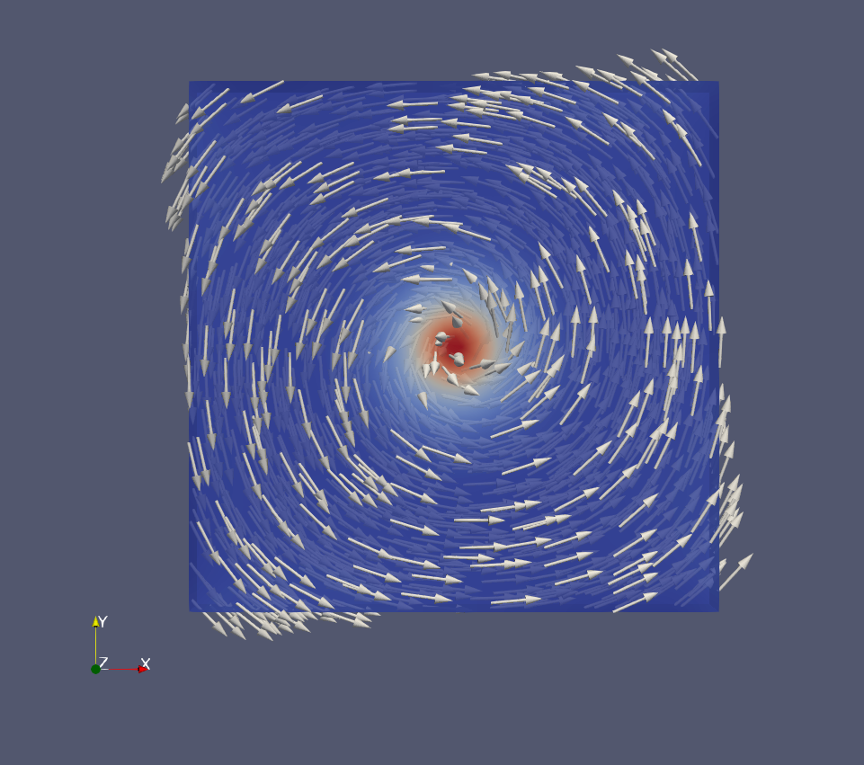
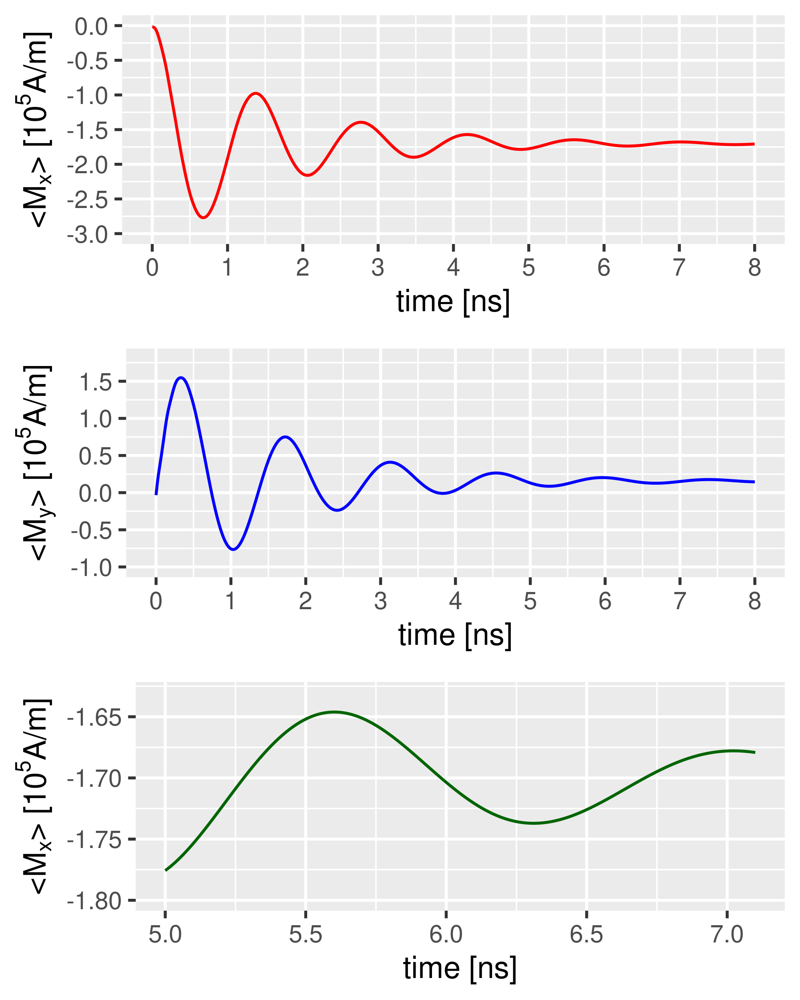

Ex. 3: Current-induced dynamics
===============================

When an electric current flows through a ferromagnetic material, it aquires a spin polarization through which the conduction electrons interact with the magnetization. This effect is described by the so-called spin-transfer torque (STT).
In this example, we simulate the STT-induced magnetization dynamics in a square Permalloy platelet. The micromagnetic problem simulated here is based on a proposal by Najafi et al., published in Ref. 1_ .

The sample is a Permalloy platelet of 100 nm :math:`\times` 100 nm :math:`\times` 10 nm size. We use FreeCAD to define the geometry and to generate an irregular FEM mesh with the netgen plugin. In our example, the mesh size is set to 2 nm, resulting in 39 246 irregularly shaped terahedral finite elements.

Calculating the initial configuration
-------------------------------------

First we simulate the initial configuration -- a vortex structure at zero external field and without spin-polarized current. The keyword ``intial state = vortex_xy`` can be used to generate a vortex-type initial structure, circulating in the :math:`xy` plane, from which the magnetization can be relaxed.
The ``simulation.cfg`` for this static part of the simulation is

.. code-block:: RST

	name = sp_stt
	scale = 1.e-9
	mesh type = vtk
	alpha = 1
	initial state = vortex_xy
	time step = 2 # demag refresh interval in ps
	duration = 5000  # simulation time in ps
	solver type = gpu
	torque limit = 1.e-4
	remove precession = yes

By performing the static simulation, we quickly obtain the converged state, stored in the file ``sp_stt.vtu``, which we rename to ``sp_stt_vortex.vtu``. This will be the initial state of the subsequent dynamic simulation wit STT effects.

	   
Spin-transfer-torque--driven magnetization dynamics
---------------------------------------------------

According to the problem specification, we apply a spatially homogenous dc current density :math:`j = 10^{12}` A/m\ :math:`^2` flowing along the positive :math:`x` direction. The damping constant is set to :math:`\alpha=0.1` and the non-adiabaticity parameter to :math:`\xi=0.05`. The degree of spin polarization :math:`P` is not specified in the article by Nafaji et al. For the lack of a better value, we set :math:`P=100`\%.

The above-mentioned parameters are specified in the ``simulation.cfg`` file:

	   
.. code-block:: R

   name = sp_stt
   scale = 1.e-9
   mesh type = vtk
   alpha = 0.1
   initial state = fromfile_sp_stt_vortex.vtu
   time step = 0.1 
   duration = 14000  
   solver type = gpu
		
   current type = dc 
	spin polarization = 1.0 # degree of spin polarization in stt dynamics
	current density =  1.0 # current density for STT dynamics [in 10^12 A/m^2] 
	beta = 0.05 # non-adiabaticity parameter in STT term (also known as xi)
	current theta = 90 # polar angle of electric current flow [in degrees]
	current phi = 0 # azimuthal angle of electric current flow [in degrees]

The dynamic simulation with STT yields a displacement of the vortex along a spiralling orbit, with a radius that decreases in time. The oscillatory convergence towards a new equilibrium state can be recognized in the plots of the spatially averaged :math:`x` and :math:`y` components of the magnetization as a function of time:

These results are in good agreement with the data reported in Fig. 6 of the article by Najafi et al. 1_ . Minor deviations can be attributed to the relatively coarse mesh used in this simulation, and to the fact that ``tetmag`` uses the electron gyromagnetic ratio :math:`\gamma=2.21276148\times 10^5` rad m/ As, whereas the problem specification indicates a slightly different value of :math:`2.211\times 10⁵` rad m / As.
Other data that the authors of Ref. 1_ suggest for comparison are the average :math:`x` and :math:`y` components of the magnetization of the equilibrium state reached after 14 ns. Our simulation yields :math:`\langle M_x\rangle = -1.7009\times 10^5` A/m and  :math:`\langle M_y\rangle = 1.566  \times 10^4` A/m, which compares fairly well with the data reported in Table 1 of Ref. 1_ . Here, too, we expect to obtain better agreement when using smaller sizes.

.. [1] `Najafi, M.; Krüger, B.; Bohlens, S.; Franchin, M.; Fangohr, H.; Vanhaverbeke, A.; Allenspach, R.; Bolte, M.; Merkt, U.; Pfannkuche, D.; Möller, D. P. F.; Meier, G. Proposal for a Standard Problem for Micromagnetic Simulations Including Spin-Transfer Torque. J. Appl. Phys. 105, 113914 (2009) <https://doi.org/10.1063/1.3126702>`_
 
