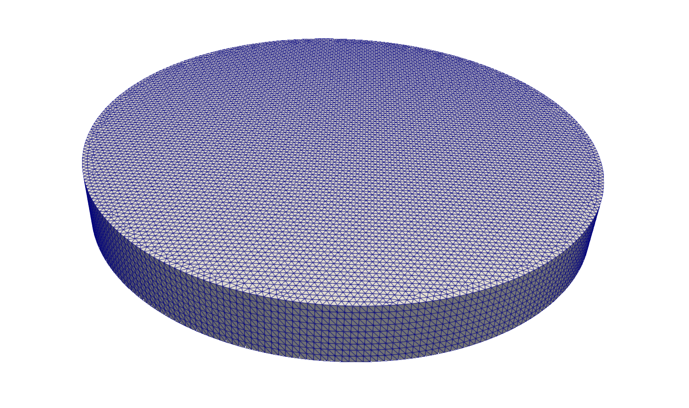
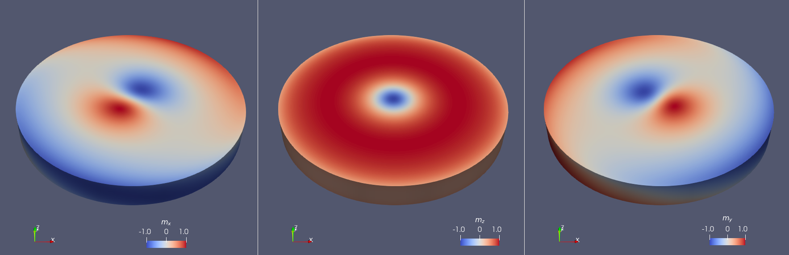

Ex. 4: Skyrmion in a FeGe nanocylinder
======================================

Magnetic textures in materials with Dzyaloshinskii–Moriya interaction (DMI) can be simulated by specifying a non-zero DMI constant. The "bulk" type DMI is considered in the form of an additional term in the system's energy density

.. math::
   e_\text{DMI} = D\cdot\vec{m}\cdot(\nabla\times\vec{m})

where the DMI constant :math:`D` is a scalar quantity expressed in units of [J/m\ :sup:`2`].
The value of :math:`D` can be set in the ``material001.dat`` file alongside the other material parameters.

In this example, we will simulate a skyrmion texture developing in a FeGe nanocylinder following the setup proposed by Cortés-Ortuño *et al.* in Ref. [\ 2_\ ].

Geometry and mesh
-----------------
Specifically, we will consider a FeGe cylinder with a radius :math:`r = 91.5` nm and a thickness :math:`d = 21` nm. The cylinder is centered at the origin of the Cartesian reference frame (0,0,0), and its top and bottom surfaces are parallel to the *xy*-plane.
In this example, the definition of the geometry and the finite-element mesh generation is done with `gmsh <https://gmsh.info/>`_. We use a simple file :download:`cyl.geo <../../examples/example4/cyl.geo>` to define a cylinder with the required dimensions and a tetrahedral mesh with a characteristic lateral cell size of 2 nm. Along the thickness, the geometry is discretized into nine equidistant layers.

With the input file ``cyl.geo``, the finite-element mesh can be generated by using the command-line interface:

.. code-block:: RST

		$ gmsh -3 cyl.geo

This yields a mesh of about 450,000 elements and 78,000 nodes that is stored in a file named ``cyl.msh``. To supply this finite-element mesh to ``tetmag``, the ``simulation.cfg`` file contains the following entries:

.. code-block:: RST

		name = cyl
		mesh type = msh

Simulation parameters
---------------------
The material's spontaneous magnetization is :math:`M_s= 384` kA/m, the ferromagnetic exchange constant :math:`A=8.78` pJ/m, and the DMI constant :math:`D=1.58` mJ/m\ :sup:`2` . Correspondingly, the ``material001.dat`` file contains these entries:

.. code-block:: RST

		A = 8.78e-12
		Ms = 0.384e6
		D = 1.58e-3

An external magnetic field :math:`\mu_0H_\text{ext}=400` mT is applied along the positive *z* direction.
As initial configuration, we choose a uniform magnetization oriented along the negative *z* direction, opposite to the applied magnetic field. This is achieved by adding the entry

.. code-block:: RST

		initial state = homogeneous_mz

in the ``simulation.cfg`` file.

Since we are only interested in the static, converged state, we discard the magnetization dynamics in the simulation by setting a large value of the Gilbert damping constant, removing the precession term, and choosing a large time step:

.. code-block:: RST

		alpha = 1.0
		remove precession = yes
		time step = 2

Although not stated explicitly in Ref. [\ 2_\ ], the magnetostatic field is *not* considered in the simulations of this example. Only the Zeeman term, the DMI, and the ferromagnetic exchange interaction are included. Since ``tetmag`` considers the magnetostatic field calculation by default, it is necessary to address this particular situation by setting the option

.. code-block:: RST

		remove demag = yes

in the ``simulation.cfg`` file.

Skyrmion magnetization texture
------------------------------

The simulation should converge fairly quickly and result in a magnetic skyrmion structure:

An analysis of the magnetization profile can be performed by extracting the values of the magnetization components along cutlines. This can be done with ParaView. In the image below, frame (a) displays the radial (orange) azimuthal (green) and perpendicular (blue) magnetization components along a radial cutline at the center of the cylinder, while frame (b) shows these values along a radial cutline on the cylinder's bottom surface.

.. image:: ./../figs/example4/skyrmion_linescans.png

The graphs accurately reproduce the results reported in Figure 3 of Ref. [\ 2_\ ].

The complete input files for this example simulation are stored in the `GitHub repository <https://github.com/R-Hertel/tetmag/tree/main/examples/example4/>`_

.. [2] `D. I. Cortés-Ortuño, M. Beg, V. Nehruji, L. Breth, R. Pepper, T. Kluyver, G. Downing, T. Hesjedal, P. Hatton, T. Lancaster, R. Hertel, O. Hovorka, H. Fangohr, Proposal for a Micromagnetic Standard Problem for Materials with Dzyaloshinskii-Moriya Interaction. New J. Phys. 20, 113015 (2018). <https://doi.org/10.1088/1367-2630/aaea1c>`_
