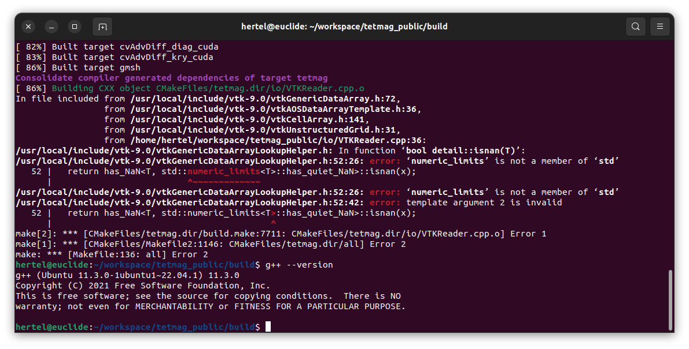

Issues and incompatibilities
=============================

Various difficulties can be encountered when compiling ``tetmag``.
These issues are not necessarily directly due to the ``tetmag`` software, but may result from its dependencies and their intercompatibility. Here we discuss a few known issues and how to resolve them.

VTK-9.0.3
---------

Depending on the compiler that is being used, the release number 9.0.3 of the VTK library can be problematic. The issue has been discussed `here <https://discourse.vtk.org/t/compilation-error-include-limits-required-in-several-files/6496/2>`_ . Some C++ compilers implicitly include the missing header, while others complain. 

To resolve this problem, we suggest installing a more recent version of `the VTK library <https://vtk.org/download/>`_.

CUDA-12.5
---------

Using the recent version 12.5 of the CUDA toolkit, the ``tetmag`` compilation fails with an error as described `in this link <https://forums.developer.nvidia.com/t/when-upgrade-from-cuda12-4-to-12-5-the-compilation-became-broken/295814>`_ .
The problem is apparently due to `Thrust <https://developer.nvidia.com/thrust>`_
headers used in the hybrid CPU/GPU part of the software. I am currently unaware of any patch or simple fix to this issue, and it is not clear whether this is a unique situation in CUDA 12.5 or if the previous versions of CUDA allowed such hybrid use of the Thrust headers "by chance." Adapting the ``tetmag`` source code to this new situation in CUDA/Thrust will require significant changes in the software design. For the moment, we recommend reverting to `CUDA 12.4 <https://developer.nvidia.com/cuda-12-4-1-download-archive>`_ if you are using CUDA 12.5.

