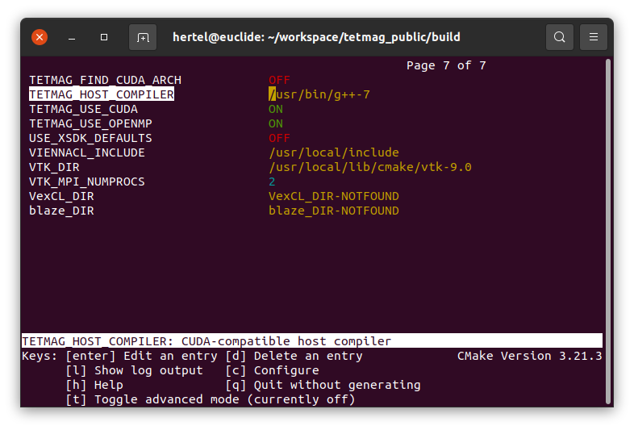

Installation Guide
==================

The ``tetmag`` software employs various programming languages, with the main part being object-oriented C++, some modules written in C, and the GPU-related modules programmed in `CUDA / Thrust <https://docs.nvidia.com/cuda/thrust/index.html>`_. Moreover, it uses several dependencies and external numerical libraries. Although care has been taken to facilitate the installation process as far as possible, one may encounter difficulties in combining the various dependencies, preparing the necessary environment, and compiling the software. This installation guide describes the main steps required to compile ``tetmag``. We will focus on the Linux operating system, and more specifically on the ubuntu distribution. Nevertheless, the software and its dependencies are platform-independent. It should thus be possible to install ``tetmag`` on other operating systems. While we primarily use ubuntu Linux, we have succesfully compiled ``tetmag`` also on MacOS and other Linux distributions.

Prerequisites
-------------

Most of ``tetmag``\'s dependencies are available as precompiled packages that can be readily installed from software repositories.  However, in some cases (which we will discuss below), we recommend installing the software from the source to reduce the risk of version mismatches which could lead to situations where some dependencies require more recent versions of other dependencies than those provided by the repositories. We will start by installing a few packages from the ubuntu repository:

.. code-block:: bash

   apt-get install build-essential git wget
   apt-get install libnetcdf-dev liblapack-dev libglu1 libpthread-stubs0-dev
   apt-get install libxrender-dev libxcursor-dev libxft-dev libxinerama-dev
   apt-get install qtbase5-dev qtdeclarative5-dev

   
CMAKE
^^^^^
In the case of CMAKE, instead of using a packaged version available through repositories, we recommend to install a recent version of `CMAKE <https://cmake.org/download/>`_ from source. The installation process is described `here <https://cmake.org/install/>`_ and is usually unproblematic. Once the process is completed, the correctness of the CMAKE installation can be checked at the command-line interface with

.. code-block:: bash

    cmake --version

As of Juli 2023, we recommend a CMAKE version of 3.21 or higher. CMAKE is required for the compilation process of ``tetmag`` and some of its dependencies. An insufficient CMAKE version number is a frequent reason for diffuculties when installing ``tetmag``.

VTK
^^^

The `VTK library <https://vtk.org/download/>`_ is used by ``tetmag`` to read and store data related to finite-element meshes, such as calculated magnetic configurations at mesh points, or the mesh itself. It is not necessary to install ``VTK`` from source. We can use the package provided by ubuntu:

.. code-block:: bash

   apt-get install libvtk9-dev

At the moment of writing of this installation guide, the most recent major version of VTK is number 9. In the future, as other versions will likely become available, the ``libvtk`` version should be updated accordingly. In any case, we need the "dev" version of this library.

BOOST
^^^^^

The `BOOST libraries <https://www.boost.org/>`_ provide important C++ utilities used by ``temag``. We don't need to install this huge library from source, but can instead rely in this case, too, on the packaged version provided by the ubuntu repository:

.. code-block:: bash

   apt-get install libboost-all-dev

EIGEN
^^^^^

The headers-only C++ library `EIGEN <http://eigen.tuxfamily.org/>`_ can also be installed using the corresponding package provided by the repository:

.. code-block:: bash

   apt-get install libeigen3-dev

However, considering the easiness by which this headers-only library can be installed, it may be worthwhile downloading the most recent version of this library.

CUDA
^^^^

Installing the `CUDA toolkit <https://developer.nvidia.com/cuda-downloads>`_ is optional, but recommended. The toolkit offers the possibility to accelerate the simulations by performing a large portion of the computations on the graphical processing unit (GPU) rather than on the CPU, which can result in significantly increased computation speeds, especially in the case of large-scale problems.
For this feature, the system requires a CUDA-capable GPU, and the CUDA SDK must be installed. By deault, ``tetmag`` runs on the CPU. The GPU option is activated by adding an entry ``solver type = gpu`` in an input file, as discussed in the :ref:`examples <example1>` section.

Although ubuntu offers repository packages for CUDA (:code:`apt-get install nvidia-cuda-toolkit`), it is preferable to install a CUDA version provided the NVIDIA website. 
We recommend using version 10.2 or higher. The NVIDIA site from which the CUDA Toolkit can be downloaded provides a simple installer and `detailed installation instructions <https://docs.nvidia.com/cuda/cuda-installation-guide-linux/index.html>`_. Note that the system must be rebooted after the installation process.

tetmag compilation
------------------

Once the prerequisites listed above are met, compiling tetmag should be straightforward:

.. code-block:: RST

		git clone https://github.com/R-Hertel/tetmag.git 
		cd tetmag && mkdir build && cd build 
		cmake ..
		make -j$(nproc)

   
Note that an internet connection is necessary during the build process, since ``tetmag`` will download and install various external libraries. 
The compilation should end with a statement that the executable ``tetmag`` has been built:

.. code-block:: RST

	...
	[ 87%] Linking CXX executable tetmag
	[100%] Built target tetmag

The executable file can be moved or copied to a directory stored in the `$PATH` environment variable, e.g., `~/bin/`, in order to make ``tetmag`` accessible in all directories without specifying the full path of its storage location.

Compilation with CUDA
^^^^^^^^^^^^^^^^^^^^^

As explained before, the `tetmag` software can exploit GPU acceleration based on NVIDIA's `CUDA toolkit <https://developer.nvidia.com/cuda-toolkit>`_. This feature requires a CUDA-compatible graphics card and an installation of CUDA. 
To compile a version of `tetmag` with optional CUDA acceleration, the procedure is as described above, except for an additional compiler flag `-DUSE_CUDA` which should be passed to `cmake`:

.. code:: BASH
	  
    cd tetmag && mkdir build && cd build 
    cmake -DUSE_CUDA ..
    make -j$(nproc)

With the `USE_CUDA` compile option activated, ``tetmag`` should automatically detect the available GPU architectures and compile the code accordingly if the ``TETMAG_FIND_CUDA_ARCH`` flag is set. Otherwise, the executable will be compiled for a set of common architectures, listed in the variable ``GPU_ARCHITECTURES`` in the file ``./gpu/CMakeLists.txt``. It may be necessary to add to this list the architecture (`compute capability <https://en.wikipedia.org/wiki/CUDA#GPUs_supported>`_) of your machine's GPU.

Host compiler compatibility
"""""""""""""""""""""""""""

The standard compilation *without* CUDA should be unproblematic, but generating a version capable of CUDA-acceleration can be more complicated. Especially in the case of older CUDA versions, a frequent reason for difficulties is an **incompatibility of host and device compiler versions**. The compiler requirements for different CUDA distributions are summarized in a table `in this gist <https://gist.github.com/ax3l/9489132#nvcc>`_. 

It can occur that the version of the host compiler, e.g., `g++`, is too recent for the installed CUDA version. If, for example, the output of :code:`g++ --version` (entered on the command line prompt) yields `9.3.0` and :code:`nvcc --version` gives `V10.2.89`, then the default `g++` compiler cannot be used. As indicated in the table referenced above, which states that this CUDA version needs a `g++` version 8 or lower.
In such a configuration, ``tetmag``'s attempt to use the CUDA compiler `nvcc` will fail and produce an error message like this:

.. code-block:: RST
		
    #error -- unsupported GNU version! gcc versions later than 8 are not supported!

To solve this problem, an older version of the host compiler must be installed. This can be done without necessarily downgrading the standard compiler, e.g., by installing ``g++`` version 7 alongside the default ``g++`` version 9.3.0. 

Once a compatible host compiler is available, ``tetmag`` needs to know where to find it. This information can be passed with the flag `TETMAG_HOST_COMPILER`. Assuming that the ``g++-7`` compiler is located in `/usr/bin/`, the compilation would be done with

.. code:: BASH
	  
    cd tetmag/build
    cmake -DUSE_CUDA -DTETMAG_HOST_COMPILER="/usr/bin/g++-7" ..
    make -j$(nproc)

Instead of using compiler flags, a convenient way to set various parameters and options for the compilation with ``cmake`` and  ``make`` is to use `ccmake <https://cmake.org/cmake/help/latest/manual/ccmake.1.html>`_ . Most of the options displayed by the ``ccmake`` user interface refer to external libraries and usually can be left unchanged. The settings of the compilation specifically related to ``tetmag`` are stored in the variables named ``TETMAG_*``.

